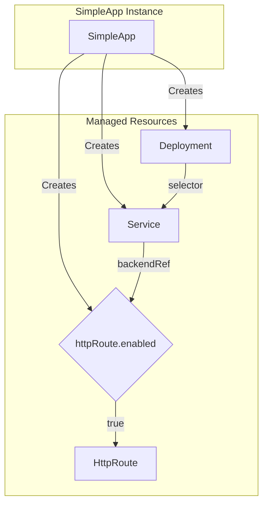

# Simpleapp
Digram describing the simpleapp resourcegraphdefinition (AI generated)

```mermaid
graph TD
    subgraph "SimpleApp Instance"
        A[SimpleApp]
    end

    subgraph "Managed Resources"
        B[Deployment]
        C[Service]
        D{httpRoute.enabled}
        E[HttpRoute]

    end

    A -- "Creates" --> B
    A -- "Creates" --> C
    A -- "Creates" --> D
    D -- "true" --> E

    B -- "selector" --> C
    C -- "backendRef" --> D

```